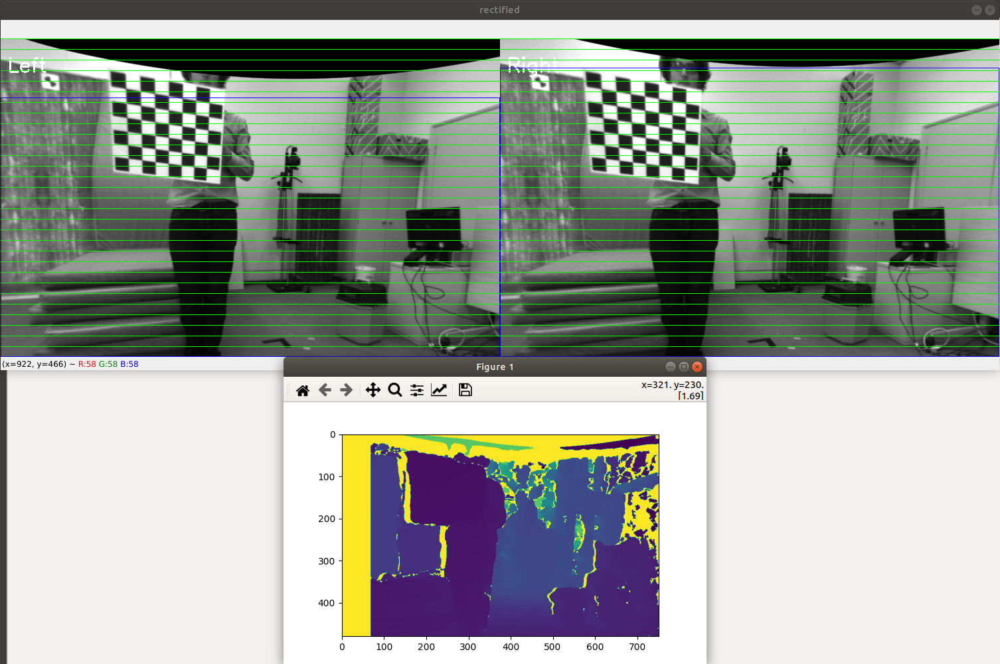

# py-stereocalibration
Python code of stereo camera calibration example code

# Introduction
This example is Python3 version of OpenCV Stereo calibration example that written in C++. ([link](https://github.com/opencv/opencv/blob/master/samples/cpp/stereo_calib.cpp)) <br/>
You must have knowledge about these term: 
- stereo camera calibration
- stereo image rectification
- depth vs disparity
- block matching

Some images will help:<br/>
 <br/>
 <br/>
 <br/>

# System requirement
Create virtual environment : 
```bash
$ pip3 install virtualenv
$ virtualenv venv_name
(Or virtualenv --system-site-packages venv_name)
$ source venv_name/bin/activate
(venv_name) $ pip3 install -r requirements.txt
```

# Example
## Example with EuRoC dataset
You can download [EuroC calibration_datasets](http://robotics.ethz.ch/~asl-datasets/ijrr_euroc_mav_dataset/calibration_datasets/cam_checkerboard/cam_checkerboard.zip) <br/>
unzip your download file.
Folder structure
```bash
cam_checkerboard
├── checkerboard_7x6.yaml
├── __MACOSX
│   └── mav0
└── mav0
    ├── cam0
    │   ├── data
    │   ├── data.csv
    │   └── sensor.yaml
    ├── cam1
    │   ├── data
    │   ├── data.csv
    │   └── sensor.yaml
    └── imu0
        ├── data.csv
        └── sensor.yaml
```
Your images will be located in:
 * cam_checkerboard/mav0/cam0/data
 * cam_checkerboard/mav0/cam1/data
  
## Modify to run example
I already prepared for you files pair-images that contain checkerboard.<br/>
You just need to modify the correct path to downloaded **cam_checkerboard** folder.<br/>
* cam0 list:  [euroc/Selected_Good_stereo_left_image_file.txt](euroc/Selected_Good_stereo_left_image_file.txt)
* cam1 list:  [euroc/Selected_Good_stereo_right_image_file.txt](euroc/Selected_Good_stereo_right_image_file.txt)

## Execute
```bash
(venv_name) $ python3 StereoCalibration.py
```
You will get output: <br/>
 <br/>


